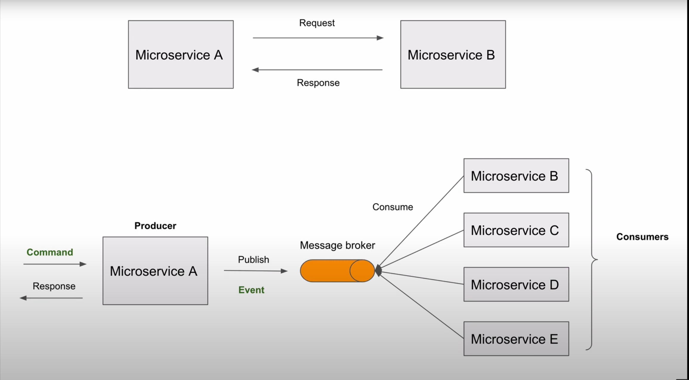
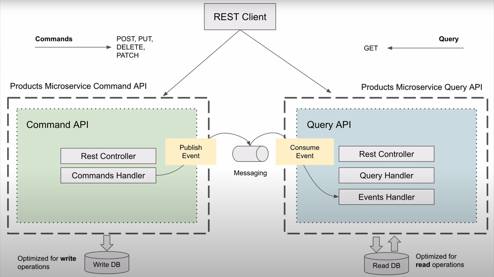
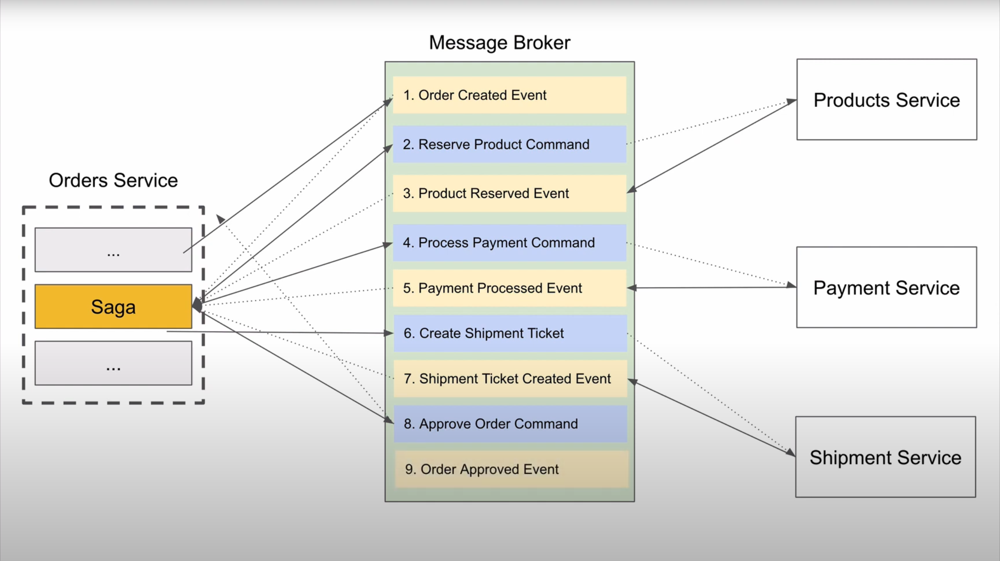

# Microservices patterns with spring
In this project, I will implement several microservices patterns, including:
- Discovery server
- Api Gateway
- CQRS
- Saga

# Frameworks and Tools
- Java 17
- Spring boot 3
- H2 database
- Eureka server Discovery
- Axon framework
- Axon server

# Event Driven

# CQRS

# Saga (Orchestration-based)
